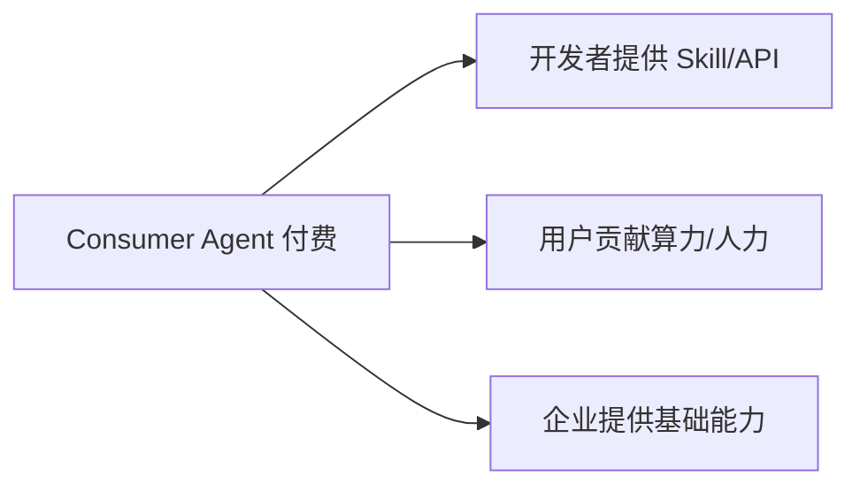

# 开发者如何在 VibeAgent 上赚钱

协议本身不发行「平台币」画饼，收益来自 **真实调用与真实任务** 的链上结算。以下是已规划或已实现的变现路径。

## 总览

| 路径 | 难度 | 收入类型 | 版本 |
|------|------|----------|------|
| Skill / Agent 运营 | ⭐⭐ | 按次/订阅/买断 | **MVP** |
| 集成商 / ISV | ⭐⭐⭐ | API 调用分成 + 服务费 | v0.2+ |
| P2P Relay / 验证节点 | ⭐⭐⭐ | 网络服务费 | v0.2+ |
| 开源贡献 + Grants | ⭐⭐ | DAO Grant / Bug Bounty | v1.0 |
| 垂直行业 Fork | ⭐⭐⭐⭐ | 协议许可 + 定制 | 持续 |
| 企业交付与运维 | ⭐⭐⭐⭐ | 项目费 + 托管 | 持续 |

---

## 1. Skill / Agent 运营（最直接）

与 [用户 · Skill 创造者](/users/skill-creator) 相同，但以开发者能力放大：

- 封装 **高质量 Skill**（工具链、RAG、行业模型网关）  
- 运营 **Agent 品牌**（多个 Skill 组合）  
- 优化定价与评价，提升市场排名（v0.2 信誉系统）  

**收入公式**：`调用次数 × 单价 × (1 - 协议费 - 版税)`

适合：独立开发者、AI 工作室、小团队。

---

## 2. 集成商与插件开发者

为 VibeAgent 生态构建 **连接层**，向使用你插件的 Creator 收费或分成：

| 产品形态 | 示例 | 赚钱方式 |
|----------|------|----------|
| MCP / Tool 适配器 | 连接 Notion、飞书、SAP | 插件订阅 |
| 模型路由 Skill | 统一对接多家 LLM | 加价路由费 |
| 数据 Skill 包 | 清洗后的行业数据集 | 按次查询费 |
| 监控面板 | Agent 收入、调用统计 | SaaS 月费（链下） |

链上 Skill 收入 + 链下 SaaS 可组合。

---

## 3. 节点运营者（P2P 基础设施）

v0.2 起需要社区运营：

| 节点类型 | 职责 | 收入 |
|----------|------|------|
| **Relay 节点** | 帮 NAT 后的 Agent 中继消息 | 中继费 / 质押奖励 |
| **Bootstrap 节点** | 网络引导 | DAO 补贴 + 小费 |
| **验证节点** | Skill 能力 attestation（EAS） | 验证费 |
| **索引节点** | 提供加速 API | 查询费 |

适合：有运维经验的 DevOps、矿池背景团队。

---

## 4. 开源贡献与经济激励

| 机制 | 说明 |
|------|------|
| **Bug Bounty** | 主网前发现漏洞按严重程度奖励 |
| **DAO Grants** | 治理国库资助核心模块（索引器、移动端、审计修复） |
| **声誉 → 业务** | 核心贡献者标签带来咨询/企业单 |
| **Popular Skill 分成** | 生态基金对高调用开源 Skill 额外补贴（提案中） |

贡献代码本身不自动发币，但 **声誉与 Grants** 在开源经济中可转化为长期收入。

---

## 5. 垂直 Fork 与行业协议

基于 MIT 协议 Fork VibeAgent，做：

- 「VibeAgent-医疗合规版」  
- 「VibeAgent-跨境电商版」  

赚钱方式：

- 行业客户 **私有化部署** 项目费  
- 认证 Skill 市场 **上架费**  
- 与企业分成的 **协议服务费**  

需注意遵守商标与品牌规范（将另行公布）。

---

## 6. 企业定制与托管服务

面向不希望自己运维钱包与节点的企业：

- 代部署 Agent / Skill（一次性）  
- 7×24 监控与升级（月费）  
- 法币结算通道对接（合规合作方）  

这是传统 **软件服务收入**，与链上协议互补。

---

## 7. 与其他角色的协同

开发者不必包揽一切——**你提供「智力模块」，人类与设备提供「执行与算力」**，共同从 Consumer 的 Escrow 中获利。

---

## 开始行动

1. **今天**：Fork 仓库，本地部署 MVP，发布第一个 Skill  
2. **本月**：阅读 [贡献指南](/developers/contribute)，提交 PR 或 Issue  
3. **本季**：跟进 [路线图](/vision/roadmap)，抢占 Relay/验证节点先机  

[参与贡献 →](/developers/contribute)
