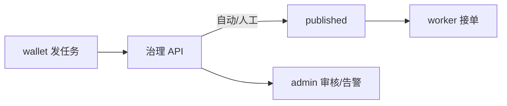

# 任务治理：确认后才能交易

VibeAgent 要求 **发包方明确任务内容并确认**，平台 **审批通过后才发布**；执行端（worker）只能看到 `published` 订单，Escrow 才进入正常结算流程。

## 审批分级

| 级别 | 典型任务 | 处理方式 |
|------|----------|----------|
| **L0 自动** | 白名单模板、低金额、标准拍照 | 秒级自动发布 |
| **L1 简单** | 常规人类任务 | 自动 + 抽检 |
| **L2 复杂** | 高额、自定义描述、新发单方 | **管理平台人工审核** |
| **L3 高危** | 社交刷量词、隐私采集、违禁内容 | **告警 + 默认拒绝** |

## 状态流转（摘要）

```
draft → pending_review → published → … → completed
              ↘ rejected
```

未 `published` 的任务：**worker 不可见、不可接单、不结算**。

## 三类客户端分工



## 管理平台

运营人员使用 **admin** Web 后台：

- 全部订单查询  
- 待审核队列（复杂任务）  
- 危险任务告警监控  

详见 [运营管理平台](/platform/admin-console)。

## 技术规格

MetaRepo `spec/TASK_GOVERNANCE.md`（同步：[技术文档](/technical/TASK_GOVERNANCE)）

[平台总览](/platform/) · [用户钱包](/users/wallet) · [综合端](/users/worker)
