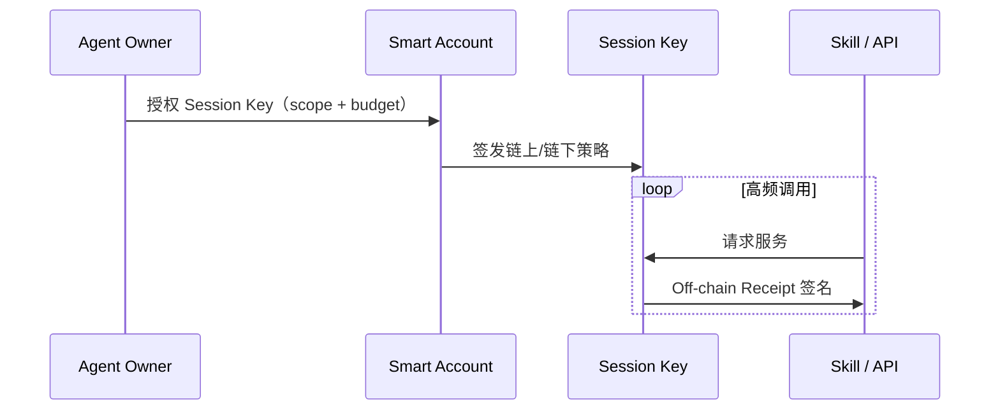

---
syncSource: VibeAgent MetaRepo spec/
doNotEdit: 璇蜂慨鏀?MetaRepo spec/ 鍚庨噸鏂拌繍琛?scripts/sync-spec-to-docs.ps1
---

> **瑙勮寖婧愭枃浠?*锛氱敱 MetaRepo `spec/` 鍚屾锛岃鍕跨洿鎺ョ紪杈戞湰椤点€?
# Agent 异步支付架构 · 放弃联盟链

**版本**: v0.1-draft · **最后更新**: 2026-06-06  
**关联**: [AGENT_CHAIN.md](./AGENT_CHAIN.md) · [FEE_TIERS_AA.md](./FEE_TIERS_AA.md) · [IOT.md](./IOT.md) · [BRIDGE.md](./BRIDGE.md)

## 1. 战略决策：绝不采用联盟链

AgentSkillMesh / VibeAgent **明确放弃联盟链（Consortium Chain）** 作为协议底座。

| 联盟链做法 | 对 Agent 经济的伤害 |
|------------|---------------------|
| 准入制节点（许可验证者） | **杀死无许可可组合性**：API 供应商、Agent 开发者、算力方须事先加入同一封闭圈子 |
| 多联盟孤岛 | **跨链信任成本** 远高于公链稳定币：微软 Agent 在链 A、谷歌 API 在链 B，对齐成本爆炸 |
| 局域网式「企业链」 | 把全球化 AI 自由市场变成 **封闭 intranet**，与「自主经济体」愿景相悖 |

**我们选择**：

- **公链 / Rollup L2**（Base → 自建 Agent L2）作为 **最终清算与信任锚点**  
- **美元计价稳定币**（USDC 等 canonical 资产，见 [BRIDGE.md](./BRIDGE.md)）作为结算单位  
- **链下异步支付协议** 承载高频路径；链上只做 **批量、异步、可验证** 的清算  

> 参考业界方向：Stripe、Coinbase、Paradigm 等将支付 **协议化、异步化**；AWS 与 Coinbase、Stripe 联合推出的 **Amazon Bedrock AgentCore Payments**（托管智能体支付）针对 Agent **高频微支付（Sub-cent）** 与资金安全工程瓶颈——VibeAgent 采用 **开放协议 + 非托管** 的等价分层，而非绑定单一云厂商托管。

## 2. 物理现实：为何不能「每笔调用都上链」

AI Agent 付费架构注定是 **高频、低延迟**；区块链是 **分布式状态机**，存在不可逾越的物理下限：

| 限制 | 量级 | 含义 |
|------|------|------|
| **网络传播延迟** | 跨洲单程 ~50–100ms（光纤 ~200km/ms） | 北京 Agent 调硅谷 LLM，光往返已占人类感知阈值 |
| **共识与密码学** | 联盟链 Raft/PBFT 亦需 1–2 轮投票 + 验签，**数 ms～数十 ms** | 无法做到「每次 API 调用同步链上确认」 |
| **链上 Gas 粒度** | 即使 L2 ~$0.0001/笔，**百万 QPS** 仍不可承受 | IoT 数据市场见 [IOT.md](./IOT.md) §3.2 |

**结论**：同步链上支付适合 **托管、争议、大额结算**；**微支付执行路径必须在链下完成**，链上 **滞后批量清算**。

## 3. 三层异步支付模型

```
┌─────────────────────────────────────────────────────────────┐
│  L1 · 执行层（微秒～毫秒）                                     │
│  Session Keys + Off-chain Signed Receipts（EIP-712 借条）      │
│  Agent ↔ Skill/API 即时授权扣款，无共识等待                      │
├─────────────────────────────────────────────────────────────┤
│  L2 · 中继与风控层（毫秒～秒）                                  │
│  api Receipt Vault · 额度/速率限制 · 争议窗口 · 批量队列        │
├─────────────────────────────────────────────────────────────┤
│  L3 · 清算层（秒～分钟～小时）                                  │
│  ERC-4337 Bundler 批量 UserOp · Escrow/MicroPayment 合约结算   │
│  Agent L2 超低 Gas · Merkle 批量提交（v0.5+）                  │
└─────────────────────────────────────────────────────────────┘
```

### 3.1 账户抽象与会话密钥（Session Keys）

基于 [FEE_TIERS_AA.md](./FEE_TIERS_AA.md) 的 **ERC-4337 Smart Account** 扩展：

| 能力 | 说明 |
|------|------|
| **Scoped Session Key** | 子密钥仅可调用指定 Skill 合约 / 最大单笔 / 时间窗口 |
| **Spend Limit** | 会话总预算（如 $5/小时 翻译 API） |
| **Revocation** | 主密钥一键撤销；链上 `SessionKeyRegistry` 记录失效高度 |
| **Paymaster** | 高等级账户 Gas 补贴；微支付链下阶段 **零 Gas** |



### 3.2 链下微秒级「借条」（Off-chain Signed Receipts）

每笔微支付 **不提交链**，而是交换 **密码学收据**：

| 字段 | 说明 |
|------|------|
| `payer` | Smart Account / Session Key 地址 |
| `payee` | Skill Provider / API 地址 |
| `amount` | 最小单位稳定币（6 decimals） |
| `asset` | canonical USDC 等 |
| `nonce` | 单调递增，防双花 |
| `skillId` / `resourceId` | 可组合 Skill 引用 |
| `timestamp` | Unix ms |
| `chainId` | 清算目标链 |
| `signature` | EIP-712 typed data |

**验证**：收款方或 api **本地验签**（<1ms）；可选提交 api `POST /receipts` 进入 **Receipt Vault**（仅 hash + 元数据，无业务 PII）。

**双花防护**：

- 会话 `nonce` 单调性 + api 短期去重缓存  
- 批量清算时合约校验 `nonce` 序列与 Merkle 包含证明  
- 超额支出 → 清算失败 + 会话撤销 + 争议流程  

### 3.3 链上异步 / 批量清算（Asynchronous Settlement）

| 模式 | 场景 | 触发 |
|------|------|------|
| **Escrow 终局结算** | 任务型雇佣（现有 `Escrow.sol`） | 交付确认 / 超时 |
| **Receipt 批量结算** | API 微调用、IoT 数据流 | 时间窗口（如 1min）/ 笔数阈值 / 金额阈值 |
| **Credit Line 净额** | 高频买卖双方 | 双向收据轧差后单次链上转账 |

**批量路径（v0.5+）**：

```
Receipt Vault 累积 N 笔 signed receipts
    → 构建 Merkle tree
    → ERC-4337 UserOperation（Bundler）
        → MicroPaymentSettler.batchSettle(root, proofs[], aggregates[])
    → 事件索引 → 各方余额更新
```

与 **Agent L2**（[AGENT_CHAIN.md](./AGENT_CHAIN.md)）协同：Sequencer 可优先打包 **结算批次**，进一步摊薄单笔 Gas。

## 4. 与 Bedrock AgentCore Payments 的对照（开放协议版）

| AgentCore Payments（托管） | VibeAgent（开放协议） |
|---------------------------|----------------------|
| 云厂商托管 Agent 钱包 | **非托管** Smart Account + Session Key |
| 集成 Stripe/Coinbase 法币 | [ONRAMP.md](./ONRAMP.md) Widget + 公链稳定币 |
| 平台内微支付 | **EIP-712 Receipt** + 任意 Skill 可组合 |
| 封闭 AWS 生态 | **无许可** Skill Registry + 公链/Rollup 清算 |

我们吸收其 **工程分层**（执行异步、清算滞后、资金安全），但坚持 **Permissionless Composability** 与 **用户自持密钥**。

## 5. 仓库与模块映射

| 层级 | 仓库 | 路径 / 模块 |
|------|------|-------------|
| 类型与 Receipt schema | `shared` | `src/payments/` ✅ |
| Receipt Vault、批量队列 | `api` | `modules/payments/` ✅ |
| Session Key 策略 UI | `wallet` / `web` | Agent 授权面板 |
| 清算合约 | `contracts` | `settlement/MicroPaymentSettler.sol`（v0.5） |
| AA + Session | `contracts` | `identity/SessionKeyRegistry.sol`（v0.3） |
| Agent SDK 签名 | `shared` + SDK | Python/TS `signReceipt()` |

### 5.1 api 端点（v0.2+ · 已实现）

| 方法 | 路径 | 说明 |
|------|------|------|
| GET | `/api/v1/payments/health` | 模块健康 |
| GET | `/api/v1/payments/disclosure` | 异步模型披露 |
| POST | `/api/v1/payments/sessions` | 注册 Session Key 策略（v0.3） |
| GET | `/api/v1/payments/sessions` | 列出会话 |
| POST | `/api/v1/payments/sessions/:id/revoke` | 撤销会话 |
| POST | `/api/v1/payments/receipts` | 提交签名收据（须已注册 Session） |
| GET | `/api/v1/payments/receipts/stats?payer=0x…` | payer nonce / pending 数 |
| GET | `/api/v1/payments/receipts/pending?limit=100` | 待批量清算列表 |

### 5.2 shared 包

```typescript
import { signReceipt, ReceiptVaultService, hashReceipt } from '@vibe-agent/shared/payments';
```

## 6. 版本路线

| 版本 | 交付 | 验收 |
|------|------|------|
| **v0.2** | Receipt EIP-712 schema + api 验签 PoC | 1 万笔/分链下验签；零链上 tx |
| **v0.3** | Session Key + Smart Account 策略合约 |  scoped key 调用 1 个 Skill；超支拒绝 |
| **v0.5** | `MicroPaymentSettler` 批量清算 + IoT 数据流 | 模拟 10 万条收据 → 1 笔链上 batch |
| **v0.7** | Agent L2 + Bundler 优先批次 + Paymaster | Sub-cent 摊销 Gas < $0.00001/笔 |

## 7. 需求 ID

| ID | 简述 | 主仓库 | 版本 |
|----|------|--------|------|
| FR-PAY-001 | 放弃联盟链；公链/Rollup only | docs, spec | **已定** |
| FR-PAY-002 | EIP-712 Off-chain Receipt schema | shared, api | v0.2 |
| FR-PAY-003 | Receipt Vault 验签与 nonce 去重 | api | v0.2 |
| FR-PAY-004 | Session Key scoped 授权 | contracts, wallet | v0.3 |
| FR-PAY-005 | Session 预算与撤销 | contracts | v0.3 |
| FR-PAY-006 | Receipt 批量 Merkle 清算 | contracts, api | v0.5 |
| FR-PAY-007 | 双向轧差净额结算 | contracts | v0.5 |
| FR-PAY-008 | Bundler + Paymaster 微支付批次 | contracts, api | v0.7 |
| FR-PAY-009 | Agent SDK `signReceipt` / `settle` | shared, SDK | v0.3 |

## 8. 风险与披露

| 风险 | 缓解 |
|------|------|
| 链下收据拒付 | 押金/信用额度 + Escrow 兜底 + 会话预算上限 |
| Session Key 泄露 | 短时效 + scope 最小化 + 主密钥撤销 |
| 批量清算延迟 | 可配置窗口；大额强制同步 Escrow |
| 监管（链下 IOU） | 最终清算在公链稳定币；法币走 [ONRAMP](./ONRAMP.md) 持牌方 |

## 9. 明确不做

- ❌ 联盟链 / 许可链 / 封闭 B2B 链  
- ❌ 每笔 API 调用同步 `eth_sendTransaction`  
- ❌ 平台托管 Agent 主私钥（对标 AgentCore 的 **非托管** 差异化）  
- ❌ 链下收据无限额、无 nonce 的「口头支付」  

---

*等级费率见 [FEE_TIERS_AA.md](./FEE_TIERS_AA.md)；跨链资产见 [BRIDGE.md](./BRIDGE.md)。*

