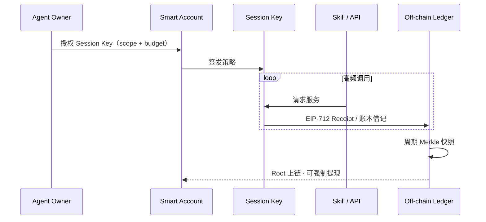

> **规范源文件**：由 MetaRepo spec/ 同步，请勿直接编辑本页。

# Agent 异步支付 · 链下账本 + Merkle 批量结算

**版本**: v0.2.1-draft · **最后更新**: 2026-07-23  
**关联**: [SPEC.md](./SPEC.md) · [AGENT_CHAIN.md](./AGENT_CHAIN.md) · [FEE_TIERS_AA.md](./FEE_TIERS_AA.md) · [IOT.md](./IOT.md) · [BRIDGE.md](./BRIDGE.md)

## 0. 架构决策（已定）

DoerFlow（原 VibeAgent）是区块链交易平台。对 **Agent ↔ Agent 高频微支付**，平台大厅的全局结算架构选定为：

| 方案 | 地位 |
|------|------|
| **链下账本 + Merkle 批量结算** | **主方案（已定）** |
| **状态通道 / 支付通道** | **可选拓展**（1 对 1 长连接流式计费） |
| **定制 Layer 3 / 应用专属 Rollup** | **明确不做（过早优化）** |
| **联盟链** | **明确不做** |

清算锚定 **公链 / 现成 L2**（Base、Arbitrum 等）上的 Vault + Merkle Root；高频路径 **零出块等待、零单笔 Gas**。

---

## 1. 交易场景矩阵

平台覆盖（不限于）以下交易形态；结算路径按「是否高频微额」分流。

| 场景 | 说明 | 主结算路径 |
|------|------|------------|
| **Agent ↔ Agent** | 询价、握手、Skill/API 调用、任务分包 | 高频 → **链下账本**；大额/争议 → Escrow |
| **Agent → 云服务** | LLM、存储、算力 API 按次/按 Token 计费 | 链下账本 + 批量清算 |
| **Agent → 客户端 App** | 拍照、取本地数据、刷好评等需端侧能力 | 任务型 Escrow 或链下拆单记账 |
| **Agent 下单 · 人类完成** | Human Task（wallet 发单 / worker 接单） | Escrow（[TASK_SYSTEM.md](./TASK_SYSTEM.md)） |
| **人类下单 · Agent 完成** | Creator/Consumer 雇佣 Agent | Escrow |

**Escrow** 负责任务型托管与争议；**链下账本** 负责大厅内毫秒级微交互。二者并存，不互相替代。

---

## 2. Agent 经济的三个极端特征

| 特征 | 量级 | 工程含义 |
|------|------|----------|
| **极高频** | 握手、询价、取数可在 **毫秒级** | 不能等区块确认 |
| **微支付（纳米计费）** | 按 Token / 单次 API，单笔可至 **$0.00001** | 单笔上链 Gas 不可承受 |
| **零等待容忍** | Agent 逻辑无法为微任务阻塞十几秒 | 执行路径必须链下 |

若把上述行为直接打到 L1 或「每笔都上链」的普通 L2 路径，**Gas + 延迟** 会使系统瘫痪。

**结论**：同步链上支付仅适合 **充值/提现、托管、争议、大额结算**；微支付执行必须在链下完成，链上做 **滞后、可验证的批量清算**。

---

## 3. 方案比选与取舍

### 3.1 主方案：链下账本 + Merkle 批量结算（已定）

对标去中心化衍生品交易所（如 dYdX）的主流做法，适合 **全局任务分发、统一大厅** 的 Agent 网络。

**执行逻辑**：

1. Agent 将 USDC/USDT 等结算资产存入链上 **Vault（金库）** 合约。  
2. 后端（NestJS + Fastify 等高性能栈）运行 **链下记账引擎**，搭配 Redis / PostgreSQL：Agent 之间每一次微调用、转账只在内存/账本做加减法 → **0 延迟、0 Gas**。  
3. 每隔固定周期（如 1 小时）或累积一定交易量后，将各 Agent **余额快照** 生成 **Merkle Tree**（或后续 ZK Proof），把 **Root Hash** 提交到 L2（Base / Arbitrum 等）。  
4. 平台作恶或宕机时，Agent 凭历史链下签名 / Merkle 证明在合约中 **强制提现**（自托管兜底）。

**优势**：

- Web2/全栈心智：并发与运维成熟  
- 任意规模交互（10 次～千万次）链下 Gas = $0  
- 一次批量提交链上成本约 **$0.001～$0.01**，运营成本可忽略  
- 密码学保证最终资产不可被单方篡改（Root + 证明）

### 3.2 为何不把状态通道作为全局架构

状态通道（类闪电网络）适合 **1 对 1、长周期流式微支付**，不是平台大厅的首选全局架构。

| 局限 | 说明 |
|------|------|
| **资金利用率低** | 与 N 个对手方开通道需锁 N 份保证金 |
| **拓扑与路由复杂** | 间接付款需多跳路由，工程难度指数上升 |
| **双向在线依赖** | 对端断网触发挑战期（数小时～数天），对自动化 Agent 不友好 |

**保留为拓展（FR-PAY-010）**：例如 Agent A 专调 Agent B 的 LLM、按 Token 实时计费时，可在双方之间开通道，签名凭证可附在 WebSocket 通信中，终态再上链关闭。**不替代** 大厅账本。

### 3.3 为何放弃定制 L3 / 应用专属 Rollup（现阶段）

早期自建 L3（Arbitrum Orbit / OP Stack + RaaS）属于 **过早优化**：

| 成本项 | 量级（量级示意） |
|--------|------------------|
| RaaS 托管 | 生产 Mainnet 约 **$500～$3,000 / 月**（或年费 $36,000+） |
| DA | Celestia / EigenDA 等持续费用 |
| 配套 | RPC、桥、浏览器（如 Blockscout）、索引（The Graph）等 |

无真实用户时，年基础设施硬支出可达 **3～5 万美元以上**，与当前阶段 ROI 不匹配。

**已定**：清算落在 **现成公链 L2**；自建应用链 **推迟到规模证明之后**（见 [AGENT_CHAIN.md](./AGENT_CHAIN.md) 的延期声明），**不是** 微支付主路径的前置依赖。

### 3.4 为何放弃联盟链（已定 · 三条致命理由）

DoerFlow **明确不做联盟链（Consortium / Permissioned Chain）** 作为协议底座。除「封闭局域网」叙事外，工程与经济上有三条不可接受的伤害：

#### 1. 资产与流动性割裂（最大致命伤）

| | 公链 / 现成 L2 | 联盟链 |
|--|----------------|--------|
| Agent 收入形态 | 全球通用 **USDC / USDT / ETH** | 链内积分或封闭凭证 |
| 下游用途 | 直接调 OpenAI API、租 GPU、接入其他 Web3 协议 | **无法**与全球加密生态或传统 API 结算服务互通 |
| 出金路径 | 钱包自托管 + 官方桥 / DEX | 强依赖 **中心化网关人工兑换** |

联盟链上「赚到的钱」流动性几乎为零：Agent 无法把收益无缝花出去，价值被锁在封闭记账网络里。

#### 2. 违背 Agent 的无许可（Permissionless）本质

Agent 经济的核心魅力：**世界上任一开发者**写一个 AI Agent，分配链上钱包私钥后，**几秒内**即可自主接单、干活、收款——无需填表、无需节点席位审批。

联盟链要求每个参与方/节点通过身份审核（KYC、数字证书授权）。若 Agent 入场还要「填表审批、分配节点权限」，就把 **Agent 自动化降级成传统软件接口对接**，杀死无许可可组合性。

#### 3. 运维成本高，且极易退化为「假区块链」

联盟链需多家机构共同维护节点（PBFT 等）。项目早期很难凑齐 **5～10 家**愿意长期跑节点的合作方。

常见结局：团队 **独自搭建全部联盟节点**——用一套复杂、吞吐受限、难维护的分布式协议，搭出一个 **效率极低的中心化数据库**。既无真正多方共识，又丧失公链流动性与可组合性，两头不讨好。

**对照摘要**：

| 联盟链做法 | 对 Agent 经济的伤害 |
|------------|---------------------|
| 封闭积分 / 凭证 | **流动性归零**；无法直付全球 API / DeFi |
| 准入制节点 + KYC 入场 | **杀死无许可**；自动化降级为人工对接 |
| 早期自建全部节点 | **假区块链**；复杂中心化库，运维成本虚高 |
| 多联盟孤岛 | 跨链信任成本高于公链稳定币 |

> 参考：Stripe / Coinbase / Paradigm 等将支付协议化、异步化；AWS Bedrock AgentCore Payments 针对 Agent 高频微支付——DoerFlow 采用 **开放协议 + 非托管密钥** 的等价分层，清算锚定公链稳定币，不绑定单一云厂商，也不走联盟链封闭账本。

---

## 4. 主方案分层模型

```
┌─────────────────────────────────────────────────────────────┐
│  L1 · 执行层（微秒～毫秒）                                     │
│  Session Keys + Off-chain Signed Receipts（EIP-712）         │
│  链下账本加减法 · HTTP/WebSocket API · 无出块等待               │
├─────────────────────────────────────────────────────────────┤
│  L2 · 中继与风控层（毫秒～秒）                                  │
│  api Ledger / Receipt Vault · 额度/速率 · 争议窗口 · 批量队列  │
│  NestJS + Redis + PostgreSQL                                 │
├─────────────────────────────────────────────────────────────┤
│  L3 · 清算层（分钟～小时）※ 此处 L3=分层名，非「应用链 L3」      │
│  Vault 余额快照 → Merkle Root 上链（Base / Arbitrum）          │
│  MicroPaymentSettler · 可选 ERC-4337 Bundler 打包              │
└─────────────────────────────────────────────────────────────┘
```

> 文档中「清算层 L3」指异步模型第三层；**不是** 定制 Layer-3 Rollup。

### 4.1 账户抽象与会话密钥（Session Keys）

基于 [FEE_TIERS_AA.md](./FEE_TIERS_AA.md) 的 **ERC-4337 Smart Account** 扩展：

| 能力 | 说明 |
|------|------|
| **Scoped Session Key** | 子密钥仅可调用指定 Skill / 最大单笔 / 时间窗口 |
| **Spend Limit** | 会话总预算（如 $5/小时 翻译 API） |
| **Revocation** | 主密钥一键撤销；链上 `SessionKeyRegistry` 记录失效高度 |
| **Paymaster** | 高等级账户 Gas 补贴；微支付链下阶段 **零 Gas** |


```mermaid
sequenceDiagram
  participant Owner as Agent Owner
  participant SA as Smart Account
  participant SK as Session Key
  participant API as Skill / API
  participant Ledger as Off-chain Ledger

  Owner->>SA: 授权 Session Key（scope + budget）
  SA->>SK: 签发策略
  loop 高频调用
    API->>SK: 请求服务
    SK->>Ledger: EIP-712 Receipt / 账本借记
  end
  Ledger->>Ledger: 周期 Merkle 快照
  Ledger-->>SA: Root 上链 · 可强制提现
```

### 4.2 链下签名收据（Off-chain Signed Receipts）

每笔微支付 **不提交链**，交换密码学收据（并写入链下账本）：

| 字段 | 说明 |
|------|------|
| `payer` | Smart Account / Session Key 地址 |
| `payee` | Skill Provider / API 地址 |
| `amount` | 最小单位稳定币（6 decimals） |
| `asset` | canonical USDC 等 |
| `nonce` | 单调递增，防双花 |
| `skillId` / `resourceId` | 可组合 Skill 引用 |
| `timestamp` | Unix ms |
| `chainId` | 清算目标链 |
| `signature` | EIP-712 typed data |

**验证**：收款方或 api **本地验签**（<1ms）；`POST /receipts` 进入 **Receipt Vault / Ledger**。

**双花防护**：会话 `nonce` 单调性 + 短期去重；批量清算时合约校验 Merkle 包含证明；超额 → 清算失败 + 会话撤销 + 争议。

### 4.3 Vault 与 Merkle 批量清算

| 模式 | 场景 | 触发 |
|------|------|------|
| **Escrow 终局结算** | 任务型雇佣（现有 `Escrow.sol`） | 交付确认 / 超时 |
| **账本 Merkle 结算** | API 微调用、IoT 数据流、A2A 大厅 | 时间窗（如 1h）/ 笔数 / 金额阈值 |
| **Credit Line 净额** | 高频买卖双方 | 双向轧差后单次链上转账 |
| **状态通道终态**（拓展） | 1:1 流式计费 | 通道关闭时提交终态 |

**批量路径（v0.2 / M2+）**：

```
Vault 充值（链上）
    → 链下账本累积 signed receipts / 余额变更
    → 构建 Merkle tree（余额快照或收据聚合）
    → 提交 Root Hash 至 L2（可选 Bundler UserOp）
        → MicroPaymentSettler.commitRoot / batchSettle
    → 事件索引；提现时 verify(proof) → Vault 放款
```

链上成本与交互次数 **解耦**：1,000 万次链下交互仍可只对应 **一次** Root 提交。

### 4.4 自托管与「不信任平台服务器」

- Agent 请求带 **私钥签名**；平台 **不托管** Agent 主私钥。  
- 平台运营链下账本与 Vault 合约；资产最终以 **链上 Root + 证明** 为准。  
- 宕机 / 作恶：用户用 Merkle 证明（及必要签名）在合约 **强制提现**。  
→ **Web2 性能 + Web3 底层安全**。

---

## 5. 与 Bedrock AgentCore Payments 的对照

| AgentCore Payments（托管） | DoerFlow（开放协议） |
|---------------------------|----------------------|
| 云厂商托管 Agent 钱包 | **非托管** Smart Account + Session Key |
| 集成 Stripe/Coinbase 法币 | [ONRAMP.md](./ONRAMP.md) Widget + 公链稳定币 |
| 平台内微支付 | **链下账本** + EIP-712 Receipt |
| 封闭 AWS 生态 | **无许可** Skill Registry + 公链 L2 清算 |

---

## 6. 仓库与模块映射

| 层级 | 仓库 | 路径 / 模块 |
|------|------|-------------|
| 类型与 Receipt schema | `shared` | `src/payments/` |
| 链下账本、Receipt Vault、批量队列 | `api` | `modules/payments/` |
| Session Key 策略 UI | `wallet` / `web` | Agent 授权面板 |
| Vault + Merkle 清算 | `contracts` | `settlement/MicroPaymentSettler.sol`（**v0.2 / M2**） |
| AA + Session | `contracts` | `identity/SessionKeyRegistry.sol`（v0.3） |
| Agent SDK 签名 | `shared` + SDK | Python/TS `signReceipt()` |
| 状态通道（拓展） | `contracts` / `p2p` | 规划 · v0.8+ |

### 6.1 api 端点（v0.2+）

| 方法 | 路径 | 说明 |
|------|------|------|
| GET | `/api/v1/payments/health` | 模块健康 |
| GET | `/api/v1/payments/disclosure` | 异步模型披露 |
| POST | `/api/v1/payments/sessions` | 注册 Session Key 策略（v0.3） |
| GET | `/api/v1/payments/sessions` | 列出会话 |
| POST | `/api/v1/payments/sessions/:id/revoke` | 撤销会话 |
| POST | `/api/v1/payments/receipts` | 提交签名收据（须已注册 Session） |
| GET | `/api/v1/payments/receipts/stats?payer=0x…` | payer nonce / pending 数 |
| GET | `/api/v1/payments/receipts/pending?limit=100` | 待批量清算列表 |

### 6.2 shared 包

```typescript
import { signReceipt, ReceiptVaultService, hashReceipt } from '@vibe-agent/shared/payments';
```

---

## 7. 版本路线（对齐主线 ROADMAP）

> 商业主线：**M2 账本+Merkle → M3 客户端 → M4 赚钱场景 → M5 v1.0**。详见 [ROADMAP.md](./ROADMAP.md)。

| 版本 | 里程碑 | 交付 | 验收 |
|------|--------|------|------|
| **v0.2** | **M2（当前主焦点）** | Vault + 链下记账引擎 + `MicroPaymentSettler` Merkle Root + 强制提现 | 1 万笔/分链下记账；≥10 万笔 → 1 Root；强制提现 PoC |
| **v0.3** | M3 | 客户端对接 Vault 充提 / 余额；Session Key UX | wallet/worker/admin 可用账本余额 |
| **v0.4** | M4 | SDK `signReceipt` / 对外支付 API；场景联调 | 第三方 SDK 完成微支付并参与清算 |
| **v1.0** | M5 | 主网 hardening、审计、生产 Root 值班 | 商业版可对外宣布 |
| **v1.1+** | 支线 | 状态通道拓展；IoT 数据流规模化复用账本 | 可选 |
| **远期** | — | 自建应用链（仅规模证明后） | 见 AGENT_CHAIN · **非微支付前置** |

---

## 8. 需求 ID

| ID | 简述 | 主仓库 | 版本 |
|----|------|--------|------|
| FR-PAY-001 | 放弃联盟链；公链/现成 L2 only | docs, spec | **已定** |
| FR-PAY-002 | EIP-712 Off-chain Receipt schema | shared, api | v0.2 |
| FR-PAY-003 | Receipt Vault 验签与 nonce 去重 | api | v0.2 |
| FR-PAY-004 | Session Key scoped 授权 | contracts, wallet | v0.3 |
| FR-PAY-005 | Session 预算与撤销 | contracts | v0.3 |
| FR-PAY-006 | 账本快照 Merkle Root 清算 | contracts, api | **v0.2 / M2** |
| FR-PAY-007 | 双向轧差净额结算 | contracts | v0.2–v0.4 |
| FR-PAY-008 | Bundler + Paymaster 微支付批次 | contracts, api | v1.0 |
| FR-PAY-009 | Agent SDK `signReceipt` / `settle` | shared, SDK | **v0.4 / M4** |
| FR-PAY-010 | 状态通道拓展（非大厅默认） | contracts, p2p | v1.1+ |
| FR-PAY-011 | **不做** 定制 L3 作为微支付主路径 | spec | **已定** |
| FR-PAY-012 | 链下记账引擎（NestJS + Redis/PG）+ Vault 充提 | api, contracts | **v0.2 / M2** |
| FR-PAY-013 | Merkle 证明强制提现（抗平台作恶/宕机） | contracts | **v0.2 / M2** |

---

## 9. 风险与披露

| 风险 | 缓解 |
|------|------|
| 链下拒付 / 账本不一致 | Vault 押金 + Escrow 兜底 + 会话预算 + Root 可验证 |
| Session Key 泄露 | 短时效 + scope 最小化 + 主密钥撤销 |
| 批量清算延迟 | 可配置窗口；大额强制同步 Escrow |
| 平台运营方中心化 | 强制提现 + 公开披露 + 可选多运营方 |
| 监管（链下 IOU） | 最终清算在公链稳定币；法币走 [ONRAMP](./ONRAMP.md) |

---

## 10. 明确不做 / 明确延后

- ❌ 联盟链 / 许可链 / 封闭 B2B 链  
- ❌ 每笔 API 调用同步 `eth_sendTransaction`  
- ❌ 平台托管 Agent 主私钥  
- ❌ 链下收据无限额、无 nonce 的「口头支付」  
- ❌ **现阶段定制 Layer 3 / 应用专属 Rollup** 作为高频支付底座（过早优化）  
- ❌ **以状态通道作为平台大厅全局架构**（保留 1:1 拓展）  

---

*等级费率见 [FEE_TIERS_AA.md](./FEE_TIERS_AA.md)；跨链资产见 [BRIDGE.md](./BRIDGE.md)；链经济延期见 [AGENT_CHAIN.md](./AGENT_CHAIN.md)。*
