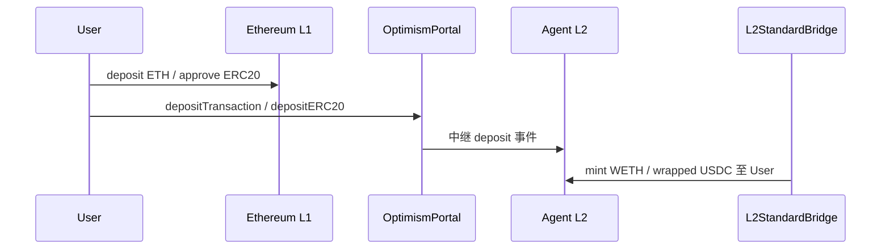

---
syncSource: VibeAgent MetaRepo spec/
doNotEdit: 璇蜂慨鏀?MetaRepo spec/ 鍚庨噸鏂拌繍琛?scripts/sync-spec-to-docs.ps1
---

> **瑙勮寖婧愭枃浠?*锛氱敱 MetaRepo `spec/` 鍚屾锛岃鍕跨洿鎺ョ紪杈戞湰椤点€?
# 跨链互通 · 原生桥与 Omnichain

**版本**: v0.1-draft · **最后更新**: 2026-06-04  
**关联**: [AGENT_CHAIN.md](./AGENT_CHAIN.md) · [ROADMAP.md](./ROADMAP.md) § M7 · [ONRAMP.md](./ONRAMP.md)

## 1. 设计原则

| 层级 | 方式 | 定位 |
|------|------|------|
| **P0 · 原生 Rollup 桥** | L1 锁仓 → L2 铸造 | **最安全、最底层**；Agent L2 与以太坊主网的主通道 |
| **P1 · 官方映射资产** | 桥接 USDC/USDT/PYUSD/ETH | 生态结算与 MetaDEX 的 **canonical 资产** |
| **P2 · Omnichain 协议** | LayerZero / CCTP / CCIP 等 | **扩展**多链 Skill、资产可达性；**不替代**原生桥安全模型 |

**铁律**：用户从以太坊进入 Agent 链的 **主路径** 必须是官方原生桥；Omnichain 仅用于已明确披露风险的快捷通道或 Skill 跨链消息。

## 2. 链演进三阶段

```
Phase 1  v0.1–v0.6   部署在 Base（已有 L2）
         └─ 用户使用 Base 官方桥（Optimism Standard Bridge）从 Ethereum → Base
         └─ 文档 + wallet 引导；不自建 L1 桥合约

Phase 2  v0.7        Agent 专用 L2 上线
         └─ OP Stack（或等价 Rollup）+ 团队 Sequencer
         └─ 部署 L1StandardBridge / L2StandardBridge / OptimismPortal
         └─ 等量 Mint WETH、USDC、USDT、PYUSD（wrapped canonical）

Phase 3  v0.8–v1.1   Omnichain 扩展
         └─ Circle CCTP（USDC 原生 burn/mint）
         └─ LayerZero OFT / CCIP（Skill 跨链、多链 USDC 可达）
```

## 3. 原生桥架构（Phase 2 · Agent L2）

采用 **Optimism Bedrock 标准桥**（OP Stack 自带），避免自研桥数学。



### 3.1 核心组件

| 组件 | 链 | 职责 |
|------|-----|------|
| **OptimismPortal** | L1 | 存款入口；绑定 L2 输出根 |
| **L1StandardBridge** | L1 | 锁 ETH、锁 ERC20（USDC/USDT/PYUSD） |
| **L2StandardBridge** | L2 | 铸造/销毁 wrapped 资产 |
| **L1CrossDomainMessenger** | L1 | L1↔L2 消息 |
| **L2CrossDomainMessenger** | L2 | 接收存款、触发 mint |
| **SystemConfig** | L1 | 链 ID、Gas 参数、桥地址注册 |

提款遵循 Rollup 标准：**7 天挑战期**（可配置，主网前审计确认）。

### 3.2 支持资产与映射

| 资产 | L1（Ethereum） | L2（Agent 链）符号 | 优先级 | 用途 |
|------|----------------|-------------------|--------|------|
| **ETH** | 原生 | **WETH**（桥铸造） | P0 | Gas、Escrow |
| **USDC** | Circle 官方 | **USDC**（bridged canonical） | P0 | 主结算稳定币 |
| **USDT** | Tether 官方 | **USDT**（bridged） | P0 | 兼容性与流动性 |
| **PYUSD** | PayPal USD | **PYUSD**（bridged） | P1 | 合规稳定币选项 |

**Canonical 规则**（`deployments.json` → `bridge.tokens`）：

- 每种 L1 资产 **唯一** L2 映射合约；禁止重复 wrapped 符号  
- MetaDEX Pool、Escrow、IoT 结算 **仅引用 canonical 列表**  
- 新增资产须 admin 多签 + 文档公示  

### 3.3 合约目录（`repos/contracts`）

与 `identity/`、`metadex/` 并列；**v0.7 前为占位与配置，完整部署随 OP Stack 创世**：

```
src/
└── bridge/
    ├── interfaces/
    │   └── ICanonicalToken.sol      # canonical 注册表接口
    ├── CanonicalTokenRegistry.sol   # L2 官方映射白名单
    └── README.md                    # 指向 OP Stack 上游桥合约，不 fork 重写
infrastructure/
└── chain/                           # MetaRepo 或 contracts 子目录
    ├── op-stack/                    # genesis、rollup.json、deploy-config
    └── bridge-monitor/              # 存款/提款状态监控（可选）
```

> **不自研** L1/L2 StandardBridge 逻辑；通过 OP Stack 部署脚本生成地址，VibeAgent 仅维护 **CanonicalTokenRegistry** 与 `deployments.json`。

### 3.4 Phase 1（Base 时代 · v0.1–v0.6）

| 项 | 做法 |
|----|------|
| 跨链 | 引导用户使用 [Base Bridge](https://bridge.base.org)（Ethereum ↔ Base） |
| 资产 | Base 上官方 USDC、USDbC、WETH 地址写入 `deployments.json` |
| wallet/web | 「充值」页 deep link 至 Base Bridge + 二维码 |
| 验收 | 文档 + UI 引导完成一笔 L1→Base USDC 存款 |

## 4. Omnichain 协议（Phase 3）

原生桥负责 **Ethereum ↔ Agent L2**；Omnichain 负责 **Agent L2 ↔ 其他链** 及 **Skill 跨链调用**。

| 协议 | 类型 | 典型用途 | 目标版本 | 备注 |
|------|------|----------|----------|------|
| **Circle CCTP** | 官方 burn/mint | USDC 跨 Base / Ethereum / Agent L2 | v0.8 | USDC **原生**跨链，非 wrapped |
| **LayerZero V2** | 消息 + OFT | Skill 跨链执行、OFT 版 USDT | v1.1 | 已有 ROADMAP v1.1 跨链 Skill |
| **Chainlink CCIP** | 消息 + Token Pool | Oracle 触发的跨链 Escrow | v1.1 | 与 IoT Oracle 协同评估 |
| **Wormhole** | 消息桥 | 备选多链 reach | 评估 | 非默认路径 |

### 4.1 与原生桥关系

```
                    ┌─────────────────┐
   Ethereum L1 ────│ Native Rollup   │──── Agent L2
                    │ Bridge (P0)     │
                    └────────┬────────┘
                             │
              ┌──────────────┼──────────────┐
              ▼              ▼              ▼
           Base          Arbitrum      (CCTP / LZ)
         Omnichain      Omnichain      扩展链
```

- **存款**：新用户优先 **L1 → Native Bridge → Agent L2**  
- **CCTP**：已有 USDC 在 Base/Ethereum 的用户可 **burn/mint** 直达，降低 wrapped 摩擦  
- **LayerZero**：Agent 跨链调用 Skill，**不**作为用户主存款路径  

### 4.2 api Port 层（链下）

与 MetaDEX 相同模式，**v0.8+** 在 `repos/api/src/modules/bridge/`：

| Port | 职责 |
|------|------|
| `IBridgeStatusReader` | 查询 L1 deposit / L2 mint 状态 |
| `IOmnichainRouter` | 路由 CCTP / LZ 报价（只读 + 构造 calldata） |
| `ICanonicalTokenList` | 读 `CanonicalTokenRegistry` + deployments |

业务 Service 不直连 RPC Adapter。

## 5. 客户端集成

| 客户端 | 原生桥 | Omnichain | 版本 |
|--------|--------|-----------|------|
| **wallet** | 「跨链充值」→ Base Bridge（Phase 1）/ Agent 桥 UI（Phase 2） | 高级入口（v0.8） | v0.3 引导 · v0.7 完整 |
| **web** | Creator 充值引导 | 同 wallet | v0.3 · v0.7 |
| **admin** | 桥监控、canonical 资产审批 | — | v0.7 |

## 6. 安全与运维

| 风险 | 缓解 |
|------|------|
| 桥合约漏洞 | OP Stack 上游审计 + 不自研核心逻辑 |
| 假 wrapped 代币 | `CanonicalTokenRegistry` + UI 只显示 canonical |
| 提款延迟 | 明确 UX：7 天挑战期说明 |
| Omnichain 中继器风险 | 默认隐藏；高级用户 opt-in + 风险披露 |
| Sequencer 停机 | 标准 Rollup 强制 inclusion 窗口 |

## 7. 需求 ID

| ID | 简述 | 主仓库 | 版本 |
|----|------|--------|------|
| FR-BRIDGE-001 | Base 官方桥引导（Phase 1） | wallet, web, docs | v0.3 |
| FR-BRIDGE-002 | OP Stack 创世 + Standard Bridge 部署 | infrastructure, contracts | v0.7 |
| FR-BRIDGE-003 | CanonicalTokenRegistry + deployments | contracts, shared | v0.7 |
| FR-BRIDGE-004 | 桥状态 Indexer / API Port | api | v0.7 |
| FR-BRIDGE-005 | wallet/web 原生桥存取款 UI | wallet, web | v0.7 |
| FR-BRIDGE-006 | Circle CCTP USDC 集成 | contracts, api | v0.8 |
| FR-BRIDGE-007 | LayerZero Skill 跨链（消息） | contracts, p2p/api | v1.1 |
| FR-BRIDGE-008 | CCIP 跨链 Escrow（评估） | contracts | v1.1 |

## 8. 验收

### Phase 1（v0.3）
- [ ] wallet「充值」deep link Base Bridge  
- [ ] 文档说明 Ethereum → Base USDC 路径  

### Phase 2（v0.7）
- [ ] Sepolia ↔ Agent L2 测试网：L1 存 0.01 ETH → L2 收到 WETH  
- [ ] L1 存 USDC → L2 canonical USDC 到账  
- [ ] 集成测试：提款发起 → 挑战期后 L1 到账（测试网可缩短）  
- [ ] MetaDEX / Escrow 仅接受 canonical 代币  

### Phase 3（v0.8 / v1.1）
- [ ] CCTP：Base USDC → Agent L2 USDC（burn/mint）  
- [ ] LayerZero：跨链 Skill 调用 PoC  

---

*法币入口见 [ONRAMP.md](./ONRAMP.md)；链经济见 [AGENT_CHAIN.md](./AGENT_CHAIN.md)。*

