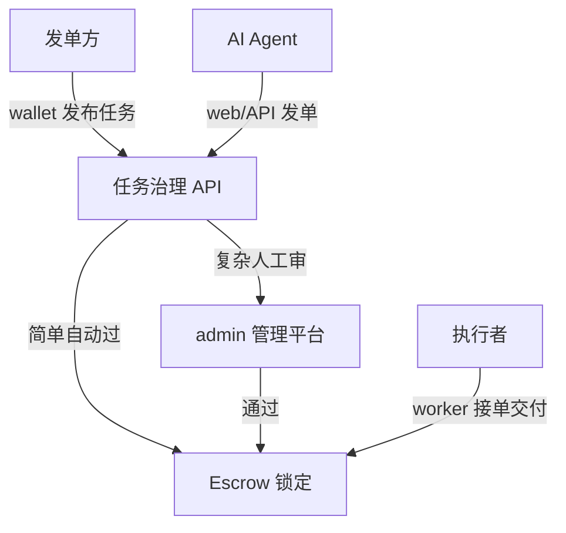

---
syncSource: VibeAgent MetaRepo spec/
doNotEdit: 璇蜂慨鏀?MetaRepo spec/ 鍚庨噸鏂拌繍琛?scripts/sync-spec-to-docs.ps1
---

> **瑙勮寖婧愭枃浠?*锛氱敱 MetaRepo `spec/` 鍚屾锛岃鍕跨洿鎺ョ紪杈戞湰椤点€?
# 客户端与平台总览

**版本**: v0.2-draft · **最后更新**: 2026-06-03

## 1. 产品矩阵

| 端 | 仓库 | 用户 | 核心能力 |
|----|------|------|----------|
| **钱包 App** | `wallet` | 发单方 / 持币用户 | 转账、余额、收益、**发布任务**（草稿→审核→上链） |
| **综合端 App** | `worker` | 任务执行者 | Agent 众包 + **社交平台任务**（无障碍） |
| **Creator DApp** | `web` | Agent 运营者 | Agent/Skill、Escrow、市场 |
| **管理平台** | `admin` | 平台运营 | 订单审核、风控告警、发布审批 |
| **文档站** | `docs` | 所有人 | 公开说明 |

## 2. 任务受众与类型

| 受众 | 代码 | 执行端 | 接单 | 验收 |
|------|------|--------|------|------|
| **AI Agent** | `audience=agent` | 协议内 Agent / web | 自动 claim（价≤上限） | 链上规则 |
| **人类** | `audience=human` | worker | 自愿 accept | 发单方 verify 或免验收 |
| 社交子类 | `taskType=social` | worker | 同上 | 默认人工审批 |

| 链上 Skill | `skill` | web | Escrow | 合约 |

详见 [TASK_SYSTEM.md](./TASK_SYSTEM.md)。

社交平台示例：抖音、小红书、知乎 — **点赞、观看、收藏** 等（须符合当地法律与平台 ToS，见合规章节）。

## 3. 发布与交易规则（摘要）

> 详细流程见 [TASK_GOVERNANCE.md](./TASK_GOVERNANCE.md)

1. 发单方在 **wallet** 填写任务模板并 **锁定 Escrow 预算**（或预授权额度）  
2. 任务进入 **治理流水线**：风险评分 → 自动/人工审批  
3. **仅 `published` 状态** 的任务对 worker 可见并可接单  
4. 执行者交付 → 验证 → Escrow 放款；争议进 admin 仲裁队列  

**原则**：未通过平台确认的任务 **不得** 对执行端展示、不得扣款结算。

## 4. 规格文档索引

| 文档 | 内容 |
|------|------|
| [WALLET.md](./WALLET.md) | 纯粹钱包 App |
| [WORKER.md](./WORKER.md) | 综合端 App（众包 + 社交） |
| [ADMIN.md](./ADMIN.md) | 管理平台 |
| [TASK_GOVERNANCE.md](./TASK_GOVERNANCE.md) | 审批分级、风控、状态机 |
| [SPEC.md](./SPEC.md) | 协议总规格 |
| [REPOS.md](./REPOS.md) | 仓库依赖 |

