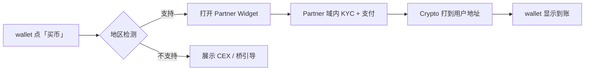

---
syncSource: VibeAgent MetaRepo spec/
doNotEdit: 璇蜂慨鏀?MetaRepo spec/ 鍚庨噸鏂拌繍琛?scripts/sync-spec-to-docs.ps1
---

> **瑙勮寖婧愭枃浠?*锛氱敱 MetaRepo `spec/` 鍚屾锛岃鍕跨洿鎺ョ紪杈戞湰椤点€?
# 法币入口 · 合规第三方 Onramp

**版本**: v0.1-draft · **最后更新**: 2026-06-04  
**关联**: [WALLET.md](./WALLET.md) · [BRIDGE.md](./BRIDGE.md) · [ROADMAP.md](./ROADMAP.md) § M3

## 1. 合规策略：不自建汇款

VibeAgent **不申请** 支付牌照、**不托管** 法币、**不处理** 用户银行卡/KYC 数据。

| 我们做 | 我们不做 |
|--------|----------|
| SDK / Widget **嵌入** 持牌合作伙伴 | 自建法币账户、SWIFT、信用卡收单 |
| 配置合作伙伴 API Key（服务端/env） | 存储用户身份证件、银行账户 |
| 引导 crypto **直达用户自托管钱包** | 平台中间 custody 法币 |
| 地区可用性检测 + 合规披露 | 在全球无差别提供法币服务 |

**法律边界**：用户与 **Stripe / MoonPay / Transak / Alchemy Pay** 等持牌方直接建立法律关系；VibeAgent 仅为 **技术集成商**。

## 2. 架构：Port / Adapter

与 MetaDEX、Bridge 模块一致，链下抽象可换合作伙伴。

```
wallet / web UI
      ↓
@shared/onramp  OnrampService
      ↓
IOnrampProvider (Port)
      ├── StripeOnrampAdapter
      ├── MoonPayAdapter
      ├── TransakAdapter
      └── AlchemyPayAdapter
      ↓
合作伙伴 Widget / Hosted URL（KYC 在对方域内完成）
      ↓
Crypto → 用户钱包地址（on-chain，非托管）
```

### 2.1 Port 接口（`shared` 或 `api` 定义）

```typescript
interface IOnrampProvider {
  id: 'stripe' | 'moonpay' | 'transak' | 'alchemypay';
  getWidgetConfig(params: OnrampWidgetParams): Promise<OnrampWidgetConfig>;
  // 可选：webhook 验签，仅更新订单状态 hash，不存 PII
}

interface OnrampWidgetParams {
  walletAddress: string;      // 必填：收款链上地址
  chainId: number;            // Base / Ethereum / Agent L2
  defaultAsset: 'USDC' | 'ETH';
  fiatCurrency?: string;        // USD, EUR...
  locale?: string;
}
```

### 2.2 仓库职责

| 仓库 | 职责 |
|------|------|
| **shared** | `@vibe-agent/shared/onramp` — 类型、`IOnrampProvider`、`OnrampService`、geo 路由 |
| **api** | `GET /onramp/providers`、`POST /onramp/session`、webhook 中继（无 PII） |
| **wallet** | RN WebView / 原生 SDK 嵌入「买币」 |
| **web** | Modal iframe / 跳转 Hosted Flow |
| **docs** | 用户披露：合作伙伴名称、费用、地区限制 |

## 3. 合作伙伴

| 合作伙伴 | 集成方式 | 主要地区 | 默认资产 | 优先级 |
|----------|----------|----------|----------|--------|
| **Stripe Crypto Onramp** | Embedded iframe | 美国等（以 Stripe 为准） | ETH, USDC | P0 |
| **MoonPay** | Web SDK / RN SDK | 全球多数 | ETH, USDC, USDT | P0 |
| **Transak** | Widget SDK | 全球 | 多链多资产 | P1 |
| **Alchemy Pay** | Widget | 亚太、欧洲 | USDC, 本地法币 | P1 |

**路由策略**（`OnrampService.selectProvider`）：

1. 按用户 IP / 选择国家过滤 **许可证覆盖**  
2. 优先 Stripe（美国）→ MoonPay（全球 fallback）→ Transak → Alchemy Pay  
3. 不可用地区：仅显示「从交易所转入」+ [Base Bridge / 原生桥](./BRIDGE.md) 引导  

## 4. 用户流程



1. 用户点击 **「买币 / Buy Crypto」**  
2. 选择或自动匹配合作伙伴（展示费率提示）  
3. 在 **合作伙伴页面** 完成 KYC 与法币支付  
4. 资产发送到用户 **已连接钱包地址**（walletConnect / 内置钱包）  
5. VibeAgent **不接收** webhook 中的姓名、证件号；仅可选记录 `txHash` + `providerOrderId` 用于支持查询  

## 5. 与跨链协同

| 步骤 | 模块 |
|------|------|
| 法币 → crypto（Base/Ethereum） | **本模块 Onramp** |
| Ethereum → Base | [BRIDGE.md](./BRIDGE.md) Phase 1 · Base Bridge |
| Ethereum → Agent L2 | [BRIDGE.md](./BRIDGE.md) Phase 2 · 原生桥 |
| Base USDC → Agent L2 | 原生桥 或 CCTP（v0.8） |

wallet「入金向导」：**买币 →（可选）跨链 → 可用余额**，一步链式引导。

## 6. 配置与环境

`repos/api/.env.example`（示例）：

```env
# Onramp — 密钥仅存服务端，不下发客户端
STRIPE_ONRAMP_PUBLISHABLE_KEY=
STRIPE_ONRAMP_SECRET_KEY=
MOONPAY_API_KEY=
MOONPAY_SECRET_KEY=
TRANSAK_API_KEY=
ALCHEMYPAY_APP_ID=
ALCHEMYPAY_SECRET=
ONRAMP_WEBHOOK_SECRET=
ONRAMP_GEO_BLOCKLIST=CN,KP,...   # 法务维护
```

客户端仅接收 **短期 session token** 或 **publishable key**，由 api `POST /onramp/session` 签发。

## 7. 需求 ID

| ID | 简述 | 主仓库 | 版本 |
|----|------|--------|------|
| FR-ONRAMP-001 | `IOnrampProvider` Port + shared 包 | shared | v0.3 |
| FR-ONRAMP-002 | MoonPay + Stripe Adapter | wallet, web, api | v0.3 |
| FR-ONRAMP-003 | wallet「买币」WebView 页 | wallet | v0.3 |
| FR-ONRAMP-004 | web Creator 买币 Modal | web | v0.3 |
| FR-ONRAMP-005 | 地区路由 + 合规披露页 | api, docs | v0.3 |
| FR-ONRAMP-006 | Transak + Alchemy Pay Adapter | wallet, web | v0.4 |
| FR-ONRAMP-007 | 入金向导（Onramp + Bridge 链式） | wallet | v0.7 |

## 8. 验收（v0.3）

- [ ] 测试网/主网：MoonPay sandbox 完成一笔 USDC → 测试钱包  
- [ ] Stripe Onramp sandbox（可用地区）  
- [ ] 不支持地区 fallback 文案 + 桥引导  
- [ ] api 日志 **无 PII** 审计通过  
- [ ] 公开 docs 披露：非 VibeAgent 收单、合作伙伴链接  

## 9. 明确不做

- 自建 OTC、P2P 法币交易  
- 平台代用户持有法币余额  
- 绕过合作伙伴直接对接银行  
- 在未获法律意见的地区默认展示 Onramp  

---

*跨链见 [BRIDGE.md](./BRIDGE.md)；钱包见 [WALLET.md](./WALLET.md)。*

