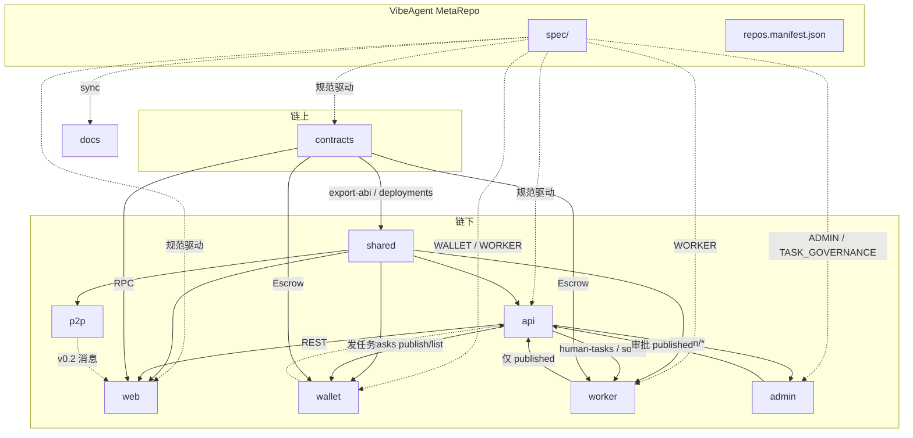

---
syncSource: VibeAgent MetaRepo spec/
doNotEdit: 璇蜂慨鏀?MetaRepo spec/ 鍚庨噸鏂拌繍琛?scripts/sync-spec-to-docs.ps1
---

> **瑙勮寖婧愭枃浠?*锛氱敱 MetaRepo `spec/` 鍚屾锛岃鍕跨洿鎺ョ紪杈戞湰椤点€?
# 仓库关系说明

**版本**: v0.1  
**最后更新**: 2026-06-04  
**清单数据源**: `repos.manifest.json`

---

## 1. 三层结构

```
AgentSkillMesh（GitHub 组织）
├── VibeAgent          MetaRepo · 私有 · 本仓库根目录
│   ├── spec/          规范源（Spec-Driven，不单独成 Git 仓）
│   ├── scripts/       克隆、初始化、同步规范
│   └── repos/         子仓库本地工作区
│       ├── docs       公开 · 文档站 + 同步后的 Spec
│       ├── contracts  私有 · 智能合约
│       ├── api        私有 · 索引 API
│       ├── web        私有 · DApp
│       ├── p2p        私有 · P2P SDK
│       ├── shared     私有 · 类型与 ABI
│       ├── wallet     私有 · RN 纯粹钱包（发任务）
│       ├── worker     私有 · RN 综合端（接单 + 社交）
│       └── admin      私有 · 运营管理（审核/告警）
```

| 层级 | 名称 | Git 仓库 | 可见性 | 职责 |
|------|------|----------|--------|------|
| 组织 | AgentSkillMesh | — | — | 品牌、GitHub 托管 |
| 产品 | VibeAgent | `AgentSkillMesh/VibeAgent` | **私有** | MetaRepo：规范、脚本、清单 |
| 子仓 | docs | `AgentSkillMesh/docs` | **公开** | Rspress 站点、白皮书、**同步 Spec** |
| 子仓 | contracts | `AgentSkillMesh/contracts` | 私有 | Solidity、部署脚本、export-abi |
| 子仓 | api | `AgentSkillMesh/api` | 私有 | 链上事件索引、REST、任务治理 API |
| 子仓 | web | `AgentSkillMesh/web` | 私有 | React DApp、wagmi（Creator） |
| 子仓 | p2p | `AgentSkillMesh/p2p` | 私有 | libp2p Beacon（v0.2+） |
| 子仓 | shared | `AgentSkillMesh/shared` | 私有 | `@vibe-agent/shared` |
| 子仓 | wallet | `AgentSkillMesh/wallet` | 私有 | RN 纯粹钱包：转账、收益、**发布任务** |
| 子仓 | worker | `AgentSkillMesh/worker` | 私有 | RN 综合端：众包接单 + 社交平台任务 |
| 子仓 | admin | `AgentSkillMesh/admin` | 私有 | 运营平台：审批、告警、订单总览 |

---

## 2. 依赖关系图



### 2.1 代码依赖（运行时 / 构建时）

| 从 → 到 | 类型 | 说明 |
|---------|------|------|
| **contracts → shared** | 构建产物 | `export-abi` 写入 ABI；`deploy` 写 `deployments.json` |
| **contracts → api** | 配置文件 | `deployments.json`、`.env` 合约地址 |
| **contracts → web** | 配置文件 | `public/deployments.json`、`.env` |
| **shared → api** | npm | `@vibe-agent/shared` 类型与常量 |
| **shared → web** | npm | 同上 |
| **shared → p2p** | npm | 同上（规划） |
| **api → web** | HTTP | DApp 调用 REST（市场列表、Escrow 索引） |
| **api → wallet** | HTTP | 发布任务、Escrow 托管、收益 |
| **api → worker** | HTTP | 已发布任务列表、交付、社交任务登记 |
| **api → admin** | HTTP | 审核队列、告警、订单统计 |
| **shared → wallet / worker** | npm | 任务/Escrow 类型 |
| **web → contracts** | RPC | Creator 钱包链上写操作 |
| **wallet → contracts** | RPC | 发单方托管/结算 |
| **worker → contracts** | RPC | 执行者接单/交付/收款 |
| **admin → api** | HTTP | 运营审批（无链上私钥） |
| **docs → 各仓** | 无代码依赖 | 仅文档与同步的 Spec |

### 2.2 变更传播顺序（跨仓 PR）

```
1. spec/SPEC.md（需求变更）
2. contracts → pnpm export-abi
3. shared（版本/tag）
4. api + web + wallet + worker + admin（联调）
5. sync-spec-to-docs → docs
```

---

## 3. 各仓库详细说明

### 3.1 VibeAgent（MetaRepo）

| 项 | 内容 |
|----|------|
| 路径 | 仓库根（非 `repos/` 下） |
| 包含 | `spec/`、`scripts/`、`repos.manifest.json`、`MVP_PLAN.md`、`WHITEPAPER.md` |
| 不包含 | 子项目 `node_modules`（`repos/*` 在 `.gitignore` 中） |
| 协作者 | 团队编排、规范评审、一键脚本 |

### 3.2 docs（公开）

| 项 | 内容 |
|----|------|
| 路径 | `repos/docs` |
| 技术栈 | Rspress |
| 与 Spec | `docs/technical/SPEC.md`、`REPOS.md` 由脚本从 `spec/` 同步 |
| 独有内容 | `users/`、`developers/`、`platform/`、`vision/`、`whitepaper/` |
| 部署 | GitHub Pages → https://agentskillmesh.github.io/docs/ |

### 3.3 contracts

| 项 | 内容 |
|----|------|
| 路径 | `repos/contracts` |
| 实现 Spec | `FR-ID-*`、`FR-SK-*`、`FR-ST-*`；**v0.15** `FR-DEX-001*` → `src/metadex/`；**v0.7** `FR-BRIDGE-*` → `src/bridge/` + OP Stack |
| 输出 | `artifacts/`、ABI → `api`/`web`/`shared` |
| 关键脚本 | `deploy:mvp`、`deploy:sepolia:full`、`deploy:metadex`、`export-abi` |

### 3.4 api

| 项 | 内容 |
|----|------|
| 路径 | `repos/api` |
| 实现 Spec | §8 REST、`FR-SK-004` 索引、Escrow 状态同步 |
| 依赖 | `shared`、`deployments.json`、SQLite（MVP） |
| 端口 | **13008**（见 `PORTS.md`） |

### 3.5 web

| 项 | 内容 |
|----|------|
| 路径 | `repos/web` |
| 实现 Spec | §5.6 DApp、`FR-UI-*` |
| 依赖 | `shared`、`api`、wagmi、链上合约 |
| 端口 | 5174 |

### 3.6 p2p

| 项 | 内容 |
|----|------|
| 路径 | `repos/p2p` |
| 实现 Spec | §5.4 `FR-P2P-*`（v0.2 Alpha） |
| 状态 | MVP 阶段为 stub |

### 3.7 shared

| 项 | 内容 |
|----|------|
| 路径 | `repos/shared` |
| 包名 | `@vibe-agent/shared` |
| 职责 | 跨仓类型、链 ID、合约地址常量、ABI 重导出 |

### 3.8 wallet（纯粹钱包 · React Native）

| 项 | 内容 |
|----|------|
| 路径 | `repos/wallet` |
| 规格 | `spec/WALLET.md`、`spec/TASK_GOVERNANCE.md` |
| 角色 | **发单方**：转账、收益、发布任务（须确认 → 待审核） |
| 依赖 | `api`（任务发布）、`shared`、链上 Escrow |
| 构建 | Expo · `pnpm start` / `android` / `ios` |

**不含**任务大厅与接单 — 见 `worker`。

### 3.9 worker（综合端 · React Native）

| 项 | 内容 |
|----|------|
| 路径 | `repos/worker` |
| 规格 | `spec/WORKER.md`、`spec/CLIENTS.md` |
| 角色 | **执行者**：众包 Human Task + 社交平台任务（无障碍 v0.4） |
| 依赖 | `api`（仅 `published` 任务）、`shared`、Escrow |
| 构建 | Expo · 包名 `@vibe-agent/worker` |

### 3.10 admin（运营管理 · Web）

| 项 | 内容 |
|----|------|
| 路径 | `repos/admin` |
| 规格 | `spec/ADMIN.md`、`spec/TASK_GOVERNANCE.md` |
| 职责 | 订单总览、简单任务自动过审、复杂人工复审、风控告警 |
| 依赖 | `api` `/admin/*` |
| 构建 | Rsbuild · 默认端口 **5175** |

与 **web** 区分：web = Creator DApp；admin = 内部运营。

---

## 4. 本地目录与 Git 远程

| 本地 `repos/` | GitHub 远程 | 默认分支 |
|---------------|-------------|----------|
| `docs` | `git@github.com:AgentSkillMesh/docs.git` | main |
| `contracts` | `git@github.com:AgentSkillMesh/contracts.git` | main |
| `api` | `git@github.com:AgentSkillMesh/api.git` | main |
| `web` | `git@github.com:AgentSkillMesh/web.git` | main |
| `p2p` | `git@github.com:AgentSkillMesh/p2p.git` | main |
| `shared` | `git@github.com:AgentSkillMesh/shared.git` | main |
| `wallet` | `git@github.com:AgentSkillMesh/wallet.git` | main |
| `worker` | `git@github.com:AgentSkillMesh/worker.git` | main |
| `admin` | `git@github.com:AgentSkillMesh/admin.git` | main |

克隆 MetaRepo 后执行：`./scripts/clone-repos.sh`

---

## 5. 与 Turborepo / 单仓的区别

| | 单仓 Monorepo | VibeAgent Polyrepo |
|--|---------------|---------------------|
| Git | 一个仓库 | MetaRepo + 9 个子仓库 |
| 规范 | 常放 `docs/` 或 `spec/` | **MetaRepo `spec/`** + 同步到 `docs` |
| 发布 | 统一版本 | 各仓独立 tag |
| 开源节奏 | 一次公开 | 当前仅 `docs` 公开，代码仓后续开源 |

---

## 6. 相关文档

- [Spec 目录说明](./README.md)
- [技术规格 SPEC.md](./SPEC.md)
- [需求追溯 traceability.md](./traceability.md)
- MetaRepo：[MVP_PLAN.md](../MVP_PLAN.md)、[NAMING.md](../NAMING.md)

