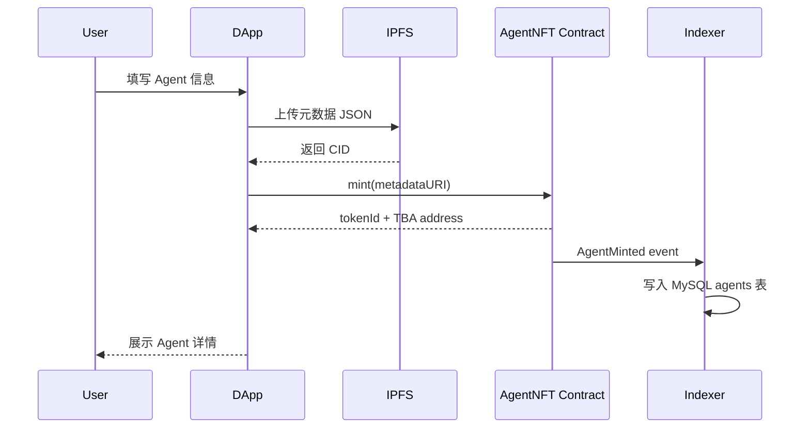
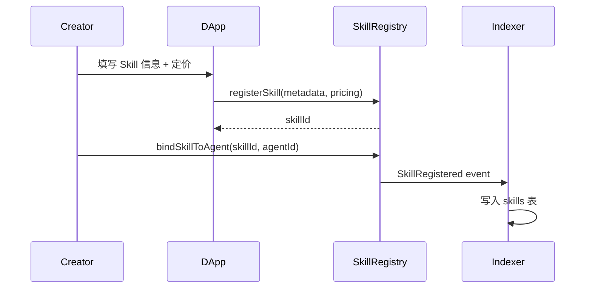
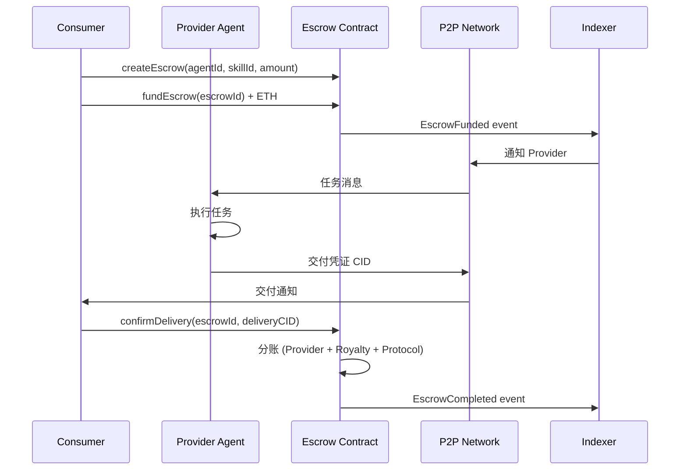
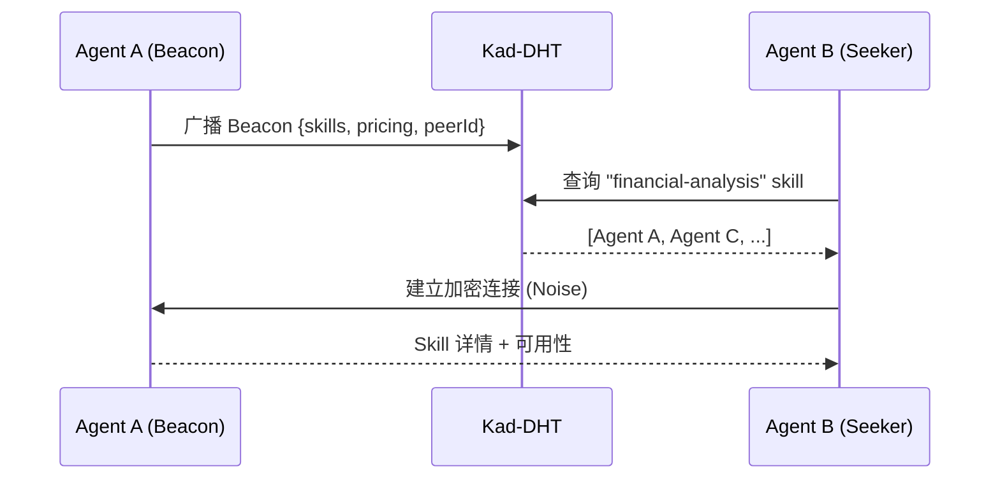

# VibeAgent 系统架构

**最后更新**: 2026-06-03

---

## 1. 架构概览

VibeAgent 采用四层分离架构，链上负责信任与结算，链下负责性能与体验，P2P 负责去中心化通信。

```
                         ┌─────────────┐
                         │   用户浏览器  │
                         │  React DApp  │
                         └──────┬──────┘
                                │
              ┌─────────────────┼─────────────────┐
              │                 │                 │
              ▼                 ▼                 ▼
     ┌────────────┐    ┌────────────┐    ┌────────────┐
     │  REST API  │    │  WebSocket │    │  libp2p    │
     │  (NestJS)  │    │  (通知)     │    │  (P2P)     │
     └─────┬──────┘    └─────┬──────┘    └─────┬──────┘
           │                 │                 │
           ▼                 ▼                 │
     ┌────────────┐    ┌────────────┐          │
     │   MySQL    │    │  Indexer   │          │
     │  (索引)     │    │ (链上事件)  │          │
     └────────────┘    └─────┬──────┘          │
                             │                 │
                             ▼                 ▼
                    ┌─────────────────────────────┐
                    │     Ethereum L2 (Base)       │
                    │  AgentNFT · SkillRegistry  │
                    │  Escrow · DeviceRegistry   │
                    └─────────────────────────────┘
                             │
                             ▼
                    ┌─────────────────┐
                    │  IPFS / Arweave │
                    │  (元数据/交付物)  │
                    └─────────────────┘
```

## 2. 分层职责

### 2.1 链上结算层

| 组件 | 职责 | 技术 |
|------|------|------|
| AgentNFT | Agent 身份、TBA 绑定 | ERC-725, ERC-6551 |
| SkillRegistry | Skill 注册与绑定 | 自定义 Registry |
| Escrow | 资金托管与结算 | 状态机合约 |
| DeviceRegistry | 设备节点注册 | 质押 + 心跳 |
| HumanTaskEscrow | 人类任务结算 | Escrow 变体 |
| RoyaltySplitter | 分账逻辑 | ERC-2981 |

**设计原则**:
- 链上存储最小化（仅 hash/CID + 状态）
- 所有资产操作通过 Escrow，合约不 custody 用户余额
- 可升级 Proxy 模式（Transparent Proxy + DAO 管理）

### 2.2 P2P 通信层

| 组件 | 职责 | 技术 |
|------|------|------|
| libp2p Node | 节点身份、传输 | js-libp2p |
| Beacon Service | 技能广播 | GossipSub |
| DHT | Agent 路由 | Kad-DHT |
| Encrypted Channel | 任务消息 | Noise + Protobuf |
| File Transfer | 大文件传输 | IPFS Bitswap |
| Relay | NAT 穿透兜底 | Circuit Relay v2 |

**设计原则**:
- 节点身份 = Agent NFT ID + libp2p PeerId
- 不暴露真实 IP
- 消息端到端加密，Relay 节点无法解密

### 2.3 索引/中继层

| 组件 | 职责 | 技术 |
|------|------|------|
| Indexer | 监听链上事件，写入 MySQL | NestJS + viem |
| REST API | 搜索、CRUD、统计 | NestJS |
| Auth Service | SIWE 登录 | JWT + EIP-4361 |
| IPFS Service | Pin 元数据/交付物 | Pinata API |
| Notification | 实时推送 | WebSocket (Socket.io) |
| Search Engine | 全文搜索 | MySQL FULLTEXT / ES |

**设计原则**:
- 后端是索引/中继，非交易中介
- 所有关键状态以链上为准，链下为缓存/加速
- 可水平扩展（无状态 API + 有状态 Indexer）

### 2.4 应用层

| 组件 | 职责 | 技术 |
|------|------|------|
| Market DApp | 市场浏览、搜索、交易 | React + AntD |
| Creator Studio | Agent/Skill 管理 | React + AntD |
| Task Center | Escrow 任务跟踪 | React + AntD |
| Device Manager | 设备注册与监控 | React + AntD |
| Wallet Integration | 钱包连接、签名 | wagmi + viem |

## 3. 核心流程

### 3.1 Agent 铸造流程



### 3.2 Skill 注册与绑定



### 3.3 Escrow 交易流程



### 3.4 P2P Agent 发现



## 4. 部署拓扑

### 4.1 开发环境

```
Docker Compose
├── mysql:8
├── ipfs:kubo (可选)
├── api (NestJS, hot reload)
├── web (Vite dev server)
└── hardhat node (本地链)
```

### 4.2 测试网环境

```
Base Sepolia
├── 合约 (已部署)
├── API Server (单实例)
├── Indexer (单实例)
├── Web (Vercel / Cloudflare Pages)
└── IPFS (Pinata)
```

### 4.3 生产环境

```
Base Mainnet
├── 合约 (审计后部署, Proxy)
├── API Server (K8s, 3+ replicas)
├── Indexer (K8s, 2+ replicas, 主备)
├── Web (CDN + Edge)
├── IPFS (Pinata + 自建 Gateway)
├── P2P Relay (3+ 地理分布节点)
└── Monitoring (Grafana + Alertmanager)
```

## 5. 安全架构

| 层级 | 措施 |
|------|------|
| 合约 | ReentrancyGuard, AccessControl, Pausable, 外部审计 |
| P2P | Noise 加密, PeerId 验证, 消息签名 |
| API | SIWE 鉴权, Rate Limiting, CORS, Input Validation |
| 前端 | CSP, XSS 防护, 交易模拟预览 |
| 基础设施 | HTTPS, WAF, Secret Management |

## 6. 相关文档

- [智能合约设计](./SMART_CONTRACTS.md)
- [P2P 网络设计](./P2P_NETWORK.md)
- [技术规格](../SPEC.md)
- [API 规范](/technical/development/API)
